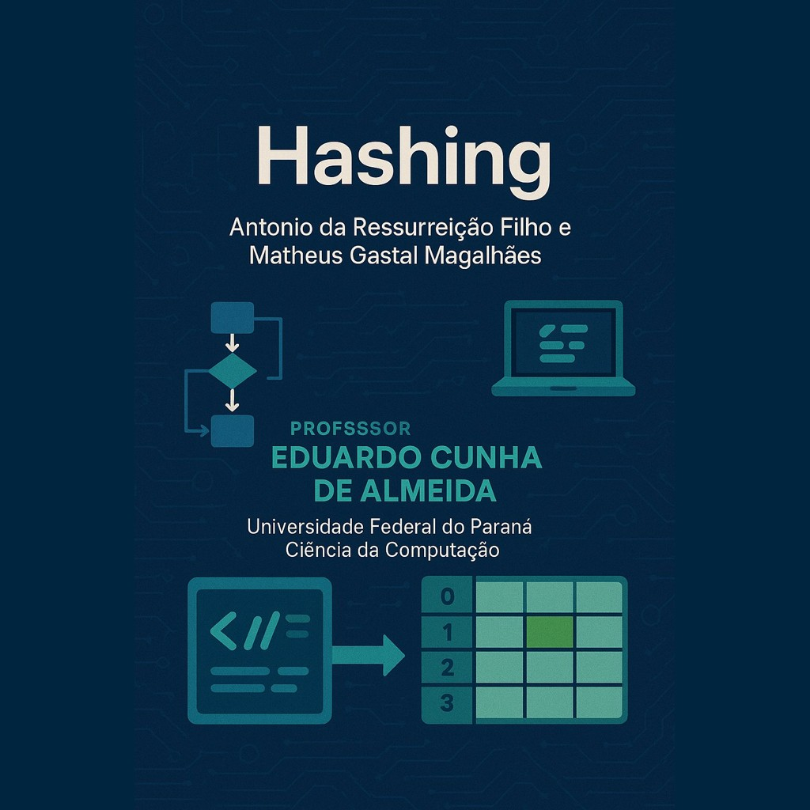

  <h1>Hashing</h1>

<h2>Desenvolvido na matéria de Algoritmos e Estruturas de dados 3 (Developed in the Algorithms & Data Structures III course)</h2>

<h2>Antonio da Ressurreição Filho and Matheus Gastal Magalhaes, students in the third semester of Computer Science at the Federal University of Paraná (UFPR).</h2>

## Professor: [Dr. Eduardo Cunha de Almeida.](https://www.inf.ufpr.br/eduardo/)

  

# Português:

O objetivo principal desse projeto é a introdução do conteúdo de Hashing aos discentes da matéria de Algoritmos e Estruturas de Dados 3 por meio de um trabalho envolvendo 2 tabelas hashing de endereçamento
aberto. Nessa perspectiva, criamos um Tipo Abstrato de Dados (TAD) Tabela Hash, com uma estrutura que contém um valor e dois booleanos de controle.

Há duas funções hash, em caso de colsão na tabela 1, o rehashing é feito usando a segunda função hash para a inserção do membro que já estava no slot da tabela 1 para o slot da tabela 2 e, com isso,
acontece a inserção do novo membro na tabela 1. Caso haja uma colisão na tabela 2, o antigo valor é sobreescrito. Cada uma das tabelas tem 11 slots.

O usuário tem também a opção de remoção de qualquer elemento que ele desejar, não importando se esse elemento está na tabela 1 ou na tabela 2.

O projeto foi dividido em 3 arquivos:
- "main.h": arquivo criado para a declaração das estruturas de dados e esqueleto das funções utilizadas ao longo do trabalho.
- "main.c": arquivo criado para que receba a entrada do usuário e tenha o loop principal, utilizando as demais funções criadas nos outros módulos.
- "makefile": arquivo criado para compilar, criar e excluir um executável do programa ("make" cria o executável e "make clean" excluir o executável).
- "tabela.c": arquivo criado para fazer as funções secundárias que são usadas ao longo de todo o programa, como criar as tabelas hash e fazer a inclusão e exclusão.
- "tabela.h": arquivo criado para fazer o esqueleto das funções secundárias utilizadas ao longo do projeto.

# English:

The main objective of this project is the concept of Hashing to the students of the course Algorithms and Data Structures 3 thought a project involving two hashing tables with open addressing. From this perspective, we created an Abstract Data Type (ADT) called Hashing Table,
using a struct that contain a value and two control booleans.

There are 2 functions, in case of collision in table 1, rehashing is performed using the second hash function to insert the previous element into table 2 and then insert the new element into table 1. If there is a collision
in table 2, the old member is overwritten. Each table has 11 slots.

The user has the option of removal of any element they wish, regardless of whether the element is in table 1 or table 2.

The project was divided into three main files:
- "main.h": File created to declare the data structures and the prototypes of the functions used throughout the project.
- "main.c": File responsible for receiving user input and containing the main loop, using the functions implemented in the other modules.
- "makefile": File created to compile, build, and delete the program's executable (make creates the executable and make clean deletes it).
- "tabela.c": File created to implement the auxiliary functions used throughout the program, such as creating the hash tables and performing insertions and deletions.
- "tabela.h": File created to declare the prototypes of the auxiliary functions used in the project.

